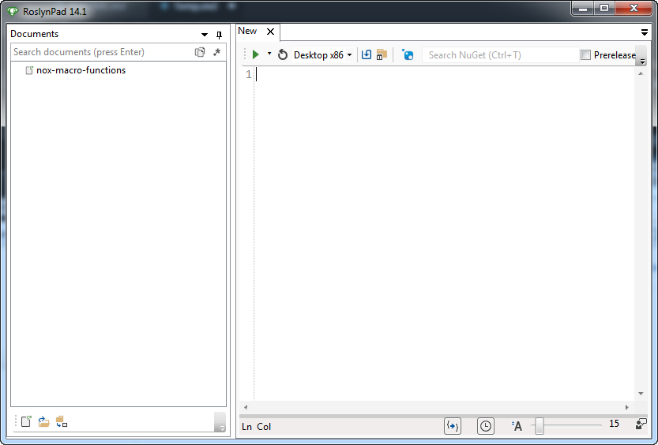
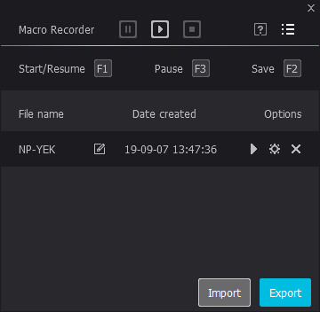
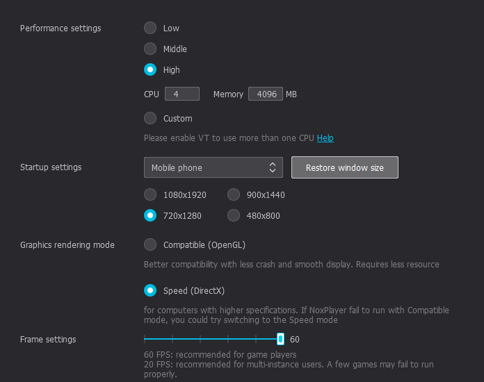

# Getting Started

To get started on writing scripts, you first need to download [RoslynPad](https://roslynpad.net/) to your computer. RoslynPad is a simple C# script editor. To make it easier to script the taps for the Game SAO: MD, a helper script was created with functions to perform different types of actions for the game, e.g. **Switch()**. 

Once you've download RoslynPad and extracted it to an appropriate location (no installation needed), run it. RoslynPad should then create a directory in you **Documents** folder in windows call **RoslynPad**. Download the helper script file [here](https://raw.githubusercontent.com/mai-pai/md-macro-gen/master/nox-macro-functions.csx) and save it to that **RoslnPad** folder. You should have something that looks similar to below when running RoslynPad.



To write your first script, copy the below template into RoslynPad.

```csharp
#r "nuget:Newtonsoft.Json/12.0.2"
#load "nox-macro-functions.csx"

StartScript(out Character unit1, out Character unit2, out Character unit3);

// script actions goes here

EndScript(CreateNoxMacro("<replace with name of macro>"));
```
Next you would want to replace `unit1`, `unit2`, and `unit3` with the names on the units in your line up, this isn't necessary but it makes it easier when writing script to know which unit you're switching to using their names.

Next you would want to replace `"<replace with name of macro>"` with the a name so that you can tell with macro it is in nox.

Now you should be all setup and should be able to start scripting. Once you've written your script, you need to either click on the  button or you can press the **F5** key on your keyboard to generate the Nox macro based on the script that you've written. Below is example script and what you should see in the Nox macro recorder. Also below is a screenshot which you can click to take you to a video of what this script does when ran in Nox.

```csharp
#r "nuget:Newtonsoft.Json/12.0.2"
#load "nox-macro-functions.csx"

// Specify the character names for unit 1, unit 2 and unit 3
StartScript(out Character Yuuki, out Character Eugeo, out Character Kirito);

Tap(1000);                  // Tap 1 second after the macro is started
Swipe(790, 200);            // 790 ms after last tap swipe right by 200 (negative number would swipe left)
SS3(100);                   // 100 ms after swipe completed execute SS3 for current unit (Yuuki)
Kirito(2000);               // 2 seconds after tapping on SS3 tap on Kirito to combo with Kirito's SS3
SwordAtkCancel(7200, 2);    // 7.2 seconds after tapping on Kirito, perform 2 sword attack cancel hits
Parry(50, 250);             // 50 ms after last action completes, start parry and release parry after 250 ms

EndScript(CreateNoxMacro("NP-YEK"));    // Create the Nox Macro and name it "NP-YEK"
```

 [](https://drive.google.com/file/d/1epG9mnjFTyGhepgy7csDeEY1nR774Dqd/view)

# Action functions

| Function Name     | Description |
|:------------------|:------------|
| `Tap`             | Performs a tap. |
| `Swipe`           | Performs a swipe. Should provide at lease `xoffset` or `yoffset` for direction of swipe. |
| `Jump`            | Performs a jump. |
| `Move`            | Moves the current unit. Should provide at least `xoffset` or `yoffset` for direction of movement. |
| `BackSwitch`      | Switch in another character on the opposite side. `xoffset` is required. |
| `Parry`           | Performs a parry. |
| `QuickLanceParry` | Perform quick lance parry with lance character. |
| `SS1`             | Tap on SS1 skill. |
| `SS2`             | Tap on SS2 skill. |
| `SS3`             | Tap on SS3 skill. |
| `SwordAtkCancel`  | Performs the sword attack cancel. |
| `RapierAtkCancel` | Performs the rapier attack cancel. |
| `DaggerAtkCancel` | Performs the dagger attack cancel. |

# Troubleshooting and Notes
If you are having issues running RoslynPad, make sure you have Microsoft's dotNet framework and dotNet core installed on your machine, when in doubt just download and installed. For **.NET Core**, use the appropriated installer for your computer.

[.NET Framework 4.7.2](https://dotnet.microsoft.com/download/thank-you/net472-developer-pack)<br/>
[.NET Core x64](https://dotnet.microsoft.com/download/thank-you/dotnet-sdk-2.2.401-windows-x64-installer) - For 64-bit Windows<br/>
[.NET Core x86](https://dotnet.microsoft.com/download/thank-you/dotnet-sdk-2.2.401-windows-x86-installer) - For 32-bit Windows

There are some Nox settings requirements to ensure the macros being generated will work correctly and they are listed below as well as a screen shot of my settings.

### Nox Setttings
- Resolution: 720x1280
- Frame Settings: 60 fps (Not required but recommended)


